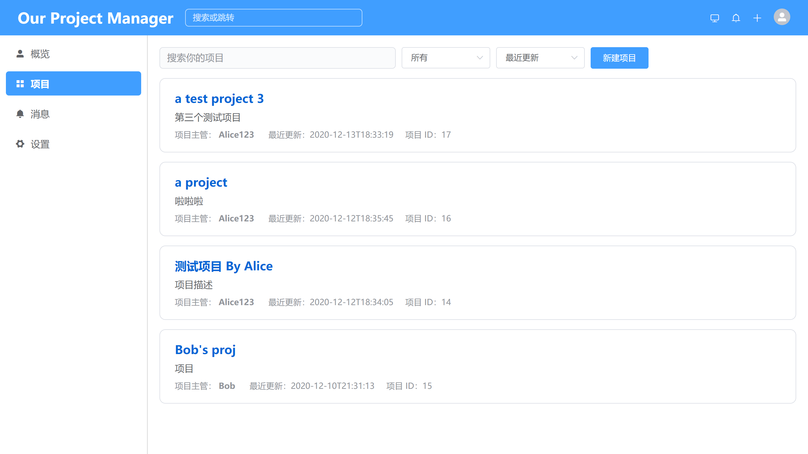
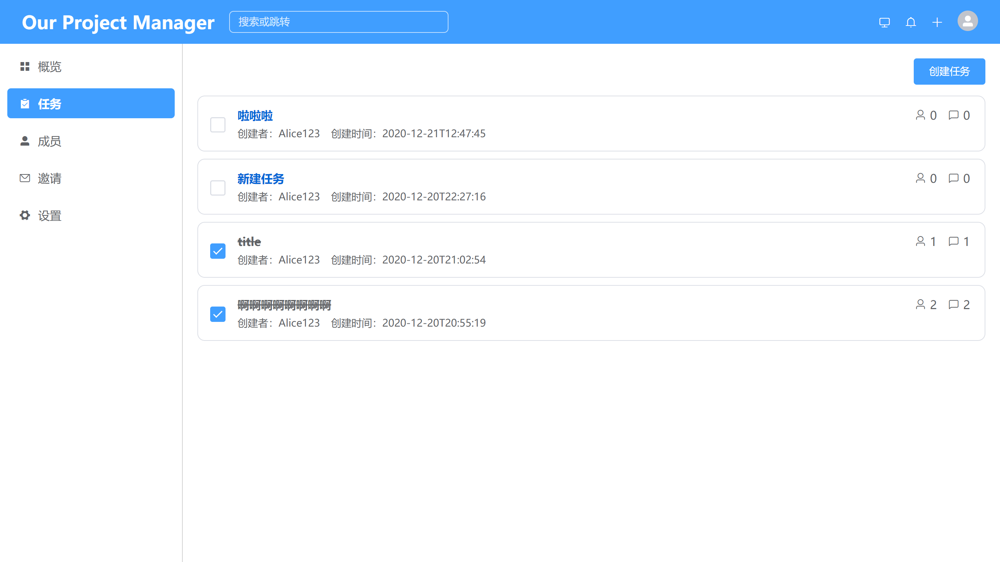
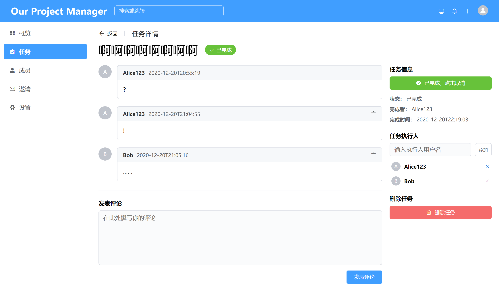

# Our Project Manager
## 简介
Java EE、软件架构大作业：多人协作的任务管理工具。

本仓库为项目的**前端**部分，**后端**及项目**文档**请移步[此处](https://github.com/whatss7/OurProjectManager)。







## Project setup
```
npm install
```

### Compiles and hot-reloads for development
```
npm run serve
```

### Compiles and minifies for production
```
npm run build
```

### Lints and fixes files
```
npm run lint
```

### Customize configuration
See [Configuration Reference](https://cli.vuejs.org/config/).
